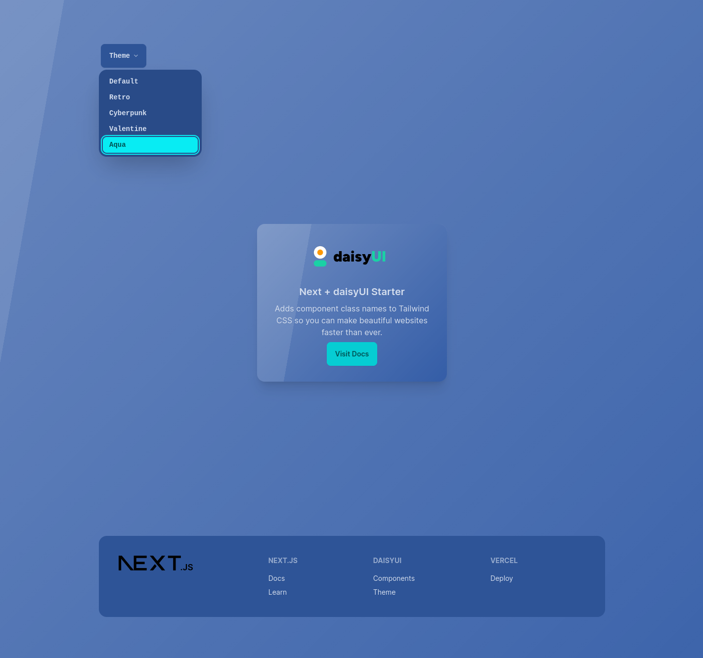

# Latest Next + Tailwind + DaisyUI Starter

A simple but powerful starter project based on the latest Next V14 App router, TailwindCSS and daisyUI with theme switcher.


- [Next.js](https://nextjs.org/)
- [TailwindCSS](https://tailwindcss.com/)
- [daisyUI](https://daisyui.com/)

## Getting Started

First install the packages via any package manager you want:

```bash
npm install
# or
yarn
# or
pnpm install
# or
bun install
```

Then, run the development server:

```bash
npm run dev
# or
yarn dev
# or
pnpm dev
# or
bun dev
```

Open [http://localhost:3000](http://localhost:3000) with your browser to see the result.

You can start editing the page by modifying `app/page.tsx`. The page auto-updates as you edit the file.

## Deploy on Vercel

The easiest way to deploy your Next.js app is to use the [Vercel Platform](https://vercel.com/new) from the creators of Next.js.

## License

MIT
